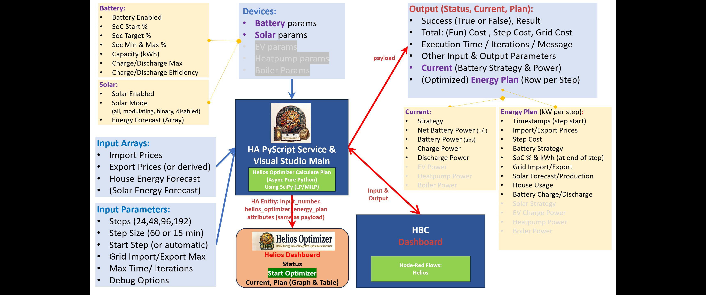

# Helios Optimizer - Documentation

## Intro and Features
For an Introduction and Feature List of the Helios Optimizer: see [Helios Optimizer - README](README.md).

## Overview

## Why use a Linear Programming Model
See [Why use Linear Programming?](WHY.md#why-lp-en) or [Waarom Lineair Programmeren gebruiken?](WHY.md#waarom-lp-nl)

## Description
Helios calculates an optimized energy plan for a specified horizon (typically 2 days)
by finding the optimal power setpoints (for battery charge/discharge, grid import/export and solar production) for each step in the optimization period.
The most important optimization rule defines that the Total Power Supply (Discharge, Import and Solar Production) and the Total Power Demand (Charge, Export and House Usage) must be equal in each step.
The Battery State of Charge (SOC) will be kept between the Minimum and the Maximum SOC Percentages in each step and at the end of the optimization period above the Target SOC.
In addition the model will keep the Charge/Discharging Power below the Battery Charge/Discharge Limit values and the Import/Export Power below the Maximum Grid Import/Export values.
Solar Production will be equal to the Solar Forecast unless the Solar Inverter can be Modulated (Dimmed) or Turned On and Off.
 
The planning horizon is defined by the number of steps and the step duration in minutes.
For example: 48 steps of 60 minutes or 192 steps of 15 minutes both optimize a 2-day period.
 
Grid Import and Export Prices, Solar Energy Forecast and House Energy Forecasts are needed as Input Arrays, containing values for every step in the period.
HBC Price Data can be used as an alternative source for the Import and Export Price arrays.
House Daily Usage and Distribution can be provided as an alternative source for the House Energy Forecast array.
 
Total Energy Cost is the sum of energy costs per step (calculated for Grid Import and Export Power).
To compensate for battery depreciation cost a discharge (default 0.01 euro) and charge cost (default 0.00) is included in the Total Energy Cost.
A cost for charging and/or discharging will also prevent the model from charging and discharging at the same time.
The optimizer aims to MINIMIZE the Total Energy Cost over the entire horizon.
Note: Negative costs may occur when exporting energy to the grid or during negative import prices.
 
Note: Without a battery or deferrable loads, optimization opportunities are limited
since a strict power balance between consumption, import, and export must be met in each step.
 
The optimization horizon always starts today (and optionally extends to the following days).
By default (with a start step of 0), the active start step is calculated based on the current time.
Optionally, a specific start step can be defined (e.g., step 1 to start at 00:00) but this is mainly meant for (regression) testing.
All input arrays must start at 00:00 today so the optimizer can align prices and forecasts correctly.
Again for (regression) testing purposes a specific optimizer timestamp can be provided that runs the optimizer for a specific date and time (instead of for the current date and time).
 
The resulting Optimized Energy Plan determines the active strategy for the current step
(e.g., NOM, Buy, Sell, Charge, Discharge, Disabled) and provides real-time setpoints
to steer the Battery Charge/Discharge, the Solar Production and (in the future) the Deferrable Loads.

### How It Works: The Energy Model
At the core of the optimizer is a physical and financial Energy Model. For each discrete time step in the optimization period (e.g., 15-minute or 1-hour intervals over 24–48 hours), the model solves a system of linear equations and constraints:
- **Energy Balance:** Ensures that at every time step, Total Power Supply (Grid Import + PV Production + Battery Discharge) equals Total Power Demand (House Load + Grid Export + Battery Charge), accounting for round-trip efficiency (RTE) of the battery.
- **Objective Function:** Minimizes net **Energy Costs** (or maximizes financial return) over the entire horizon, taking into account Dynamic Import and Export Prices, Battery Capacity and Grid and Battery Power limits.
- **Optimal Variables:** Output values are generated for Target Battery Strategy with Charge/Discharge Power and an optional PV Strategy (Modulating/Dimming or On/Off) Strategy for each step.

### Execution & Architecture
The current version runs as a PyScript Service installed in your pyscript/ folder. Pure Python modules are in the pyscript/helios_python folder.
For maximum performance, the calculation (including LinProg) runs asynchronously in a native Python thread, 
computing a full 48-hour plan in under 500ms without blocking Home Assistant.
Testing is done on a Home Assistant Operating System (HAOS) Mini-PC (with NUC: Intel Celeron J4105 CPU @ 1.50Ghz, 8Gb, SSD: 512Gb).
Feedback on the performance on other Home Assistant Environments is welcome.

**Important Note on Hardware Control**:
HELIOS Optimizer acts purely as the **Planning and Decision Engine**. 
It does **not** communicate **directly** with your Inverters, Batteries, or Smart Meters. 
Instead, it exposes Target State and Power Values back to Home Assistant. 
Physical control of hardware—such as setting charge/discharge rates or managing safety limits—is handled 
by external automation frameworks like **House Battery Control (HBC)**, **Node-RED** flows or other Home Assistant integrations.
To maintain high performance the model aggregates all available battery storage 
into a single virtual battery with combined total capacity (kWh), maximum charge/discharge rates (kW), and average round-trip efficiency.
Individual battery management—such as balancing states of charge (SoC) or routing power between multiple physical batteries 
(e.g., dual Marstek Venus units)—is offloaded to the execution layer (HBC or custom automations), 
which receives the total target power from Helios and distributes it across the physical units.

**Future releases** will migrate the PyScript architecture into a standalone Home Assistant Custom Component.

## Helios Dashboard (Input and Output)
At the top of the dashboard a short <b>Overview</b> of the Optimizer Results is displayed. 
Below that are the <b>Input Parameters</b> and more <b>Detailed Results</b> of the calculated Optimized Energy Plan (e.g. Status Blocks, Graph and Table).
<i>The <b>Helios Optimizer Service</b> will typically run every <b>quarter</b> of an hour 
and can be <b>manually</b> started with the green <b>Start Helios</b> button. 

## Input Parameters
### Optimization Parameters
- **Steps:** Optimization Steps (24-192)
- **Step Size:** Size of Each Step in Minutes (Use 15 or 60 minutes)
   Remark: Advised Optimization Period is 2 Days (48 steps of 60 minutes or 192 steps of 15 minutes)
- **House Daily Usage (Average):** Average Daily Energy Usage in the House (kWh)
   In the future the House Energy Usage will be retrieved from history data but at the moment you need to make an estimate for the average energy usage in the house. 
   Large energy users (EV, WP and Boiler) will be optimized separately in the future and will have to be excluded from the house usage but for now you may want to **include** them in the house usage. 
   **House Usage** (kWh) = Grid Import - Grid Export + Battery Daily Discharge - Battery Charge + Solar Production (all in kWh per Day)
   **Warning:** This is NOT the energy retrieved from the Grid!
- **House Daily Usage Distribution (24 Hours):** 
   How is the energy usage spread over the day (an array of 24 values, 1 value for each hour of the day).
   Each value represents only the relative energy usage for a specific hour during the day and not the exact energy usage.
   If you specify 1 for the first hour (00:00-01:00) and 3 for the 7th hour (06:00-07:00) this only means that you are using 3x times more energy in the 7th hour.
   Remark: The sum of the 24 numbers does not have to be the same as the daily usage.
- **Solar Mode:** Solar Panel Inverter Mode 
  - All: Solar Production Energy in a step is equal to the Solar Forecast Energy for the step
  - Modulating: Solar Production can be from Zero (0kWh) to the Solar Forecast Energy for the step
  - Binary: Solar Production can be ON (=Solar Forecast Energy) or OFF (0kWh) for the step
  - Disabled: Solar Production Disabled (0kWh) in each step
- **Max Grid Import:** Maximum Grid Import Power in kW
   Remark: A low maximum grid import (or export) level can make the energy plan infeasible since a power balance must always be maintained.
- **Max Grid Export:** Maximum Grid Export Power in kW
- **Sensor with the Forecast Solar Hours:** HA Entity with the Solar Forecast Energy Production (kWh) per hour
   This information is retrieved using a rest api from forecast.solar but you will need to adapt this to your own situation (location, angle, direction and peak-power):
   "https://api.forecast.solar/estimate/latitude/longitude/dak-hoek/dak-richting-180/peak-vermogen"
   Configure the solar panel information in helios_optimizer_config.yaml
   Current Limitation: Only forecast.solar is supported and only for a single roof.

### Battery Parameters
- **Battery Enabled:** Enabled or Disabled Batteries
- **Battery SOC Target:** Target Battery State of Charge Level at the END of the optimization period.
   Pick a reasonable target percentage (40%-50%) that is needed at the end of a two day optimization period.
   This value is only valid for the end of the optimization period (not for the end of the first day) and will 
  make sure that the optimizer does not empty your battery to maximize the profit.
- **Battery SOC Min:** Minimum Battery State of Charge Level which is valid at EACH step  
- **Battery SOC Max:** Maximum Battery State of Charge Level which is valid at EACH step  
- **Battery Charge Limit:** Maximum Power that can be used to Charge the Battery or Batteries (Limit applies to **all** batteries together)
- **Battery Charge Limit:** Maximum Power that can be used to Discharge the Battery or Batteries (Limit applies to **all** batteries together)
- **Battery Discharge Limit:** Maximum Discharge Limit for **all** of the batteries together
- **Battery Charge Efficiency:** Efficiency Factor for Charging the Battery
   This factor 0.70-1.00) determines how much energy is lost while charging the battery.
   For example: 4kWh is sent to the battery, charge factor of 0.9, SOC is increased with 3.60kWh (=0.9 x 4kWh).
- **Battery Discharge Efficiency:** Efficiency Factor for Discharging the Battery
   This factor 0.70-1.00) determines how much energy is lost while discharging the battery.
   For example: 4kWh is retrieved from the battery, discharge factor of 0.9, SOC is decreased with 4.44kWh (=4kWh / 0.9).
   Remark: Round Trip Efficiency (RTE) is Charge Efficiency * Discharge Efficiency (e.g. 0.81 = 0.9 x 0.9)

### Derived Parameters
These parameters are retrieved from HBC or Helios and cannot be changed by the user.
** TODO **

## Output Results
### Results Overview
- **Result:** Successful or Not (True or False), Total Cost, Grid Cost (Total Cost without Battery Cost)
- **Calculation:** Calculation Result (e.g.: Optimized, Infeasible, Exception, Balance Error, ...), Solver Iterations
- **Last Optimization Run:** Date and Time of the Last Run, Excecution Time, Lineair Programming Time (SciPy LP) 
- **Optimization Period Start:** Start Step, Date and Time for the Optimization Start 
- **Optimization Period Active Step:** Active Step (for Current Time), Date and Time for the Current/Active Step
- **Optimization Period End:** End Step, Date and Time for the Optimization End
- **Battery:** Battery Capacity, Start and End State of Charge (SOC), all in kWh 
- **Solver Status:** Solver (SciPy LP) Message or other Error Message
- **Versions:** Helios, Python and SciPy Software Levels (e.g. 1.0.0 - 3.14.6 - 1.18.1) 

### Optimized Energy Plan (Graph)
This is the most important output of the Helios Optimizer and represents for a two day window the resulting SOC Percentages for the battery 
(or for the sum of all batteries) and the Power values for the Battery (Discharge-Charge,) Solar Forecast and Production, House Usage and Grid (Import-Export).
Positive power values indicate that power is made available to the House (Battery Discharged, Solar Production or Imported) and negative values indicate that power is
used (Used in the House, Battery Charged or Exported).
  

### Optimization State
** TODO **

### Actuals for the Current Step
** TODO **

### Solar and Battery Information
** TODO **

### Optimized Energy Plan (Table)
** TODO **

### Optimization Run
** TODO **

### Energy Plan Totals
** TODO **

## Documentation
[Helios Optimizer - Documentation](DOC.md)

## Installation
[Helios Optimizer - Installation](INSTALL.md)

## Release Notes
[Helios Optimizer - Release Notes](RELEASE_NOTES.md)

## License
[Helios Optimizer - License](LICENSE "GitHub Docs")

[README](README.md) - **Doc** - [Why LP](WHY.md) - [Install](INSTALL.md) - [Release Notes](RELEASE_NOTES.md) - [License](LICENSE "GitHub Docs")
